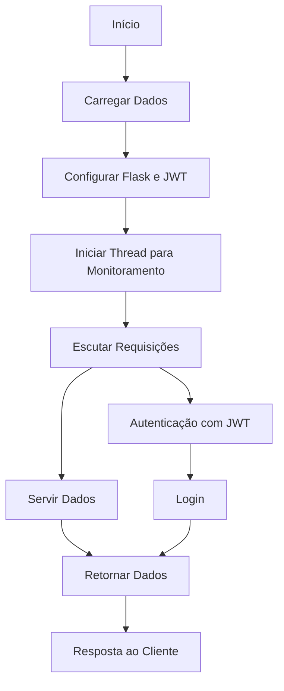
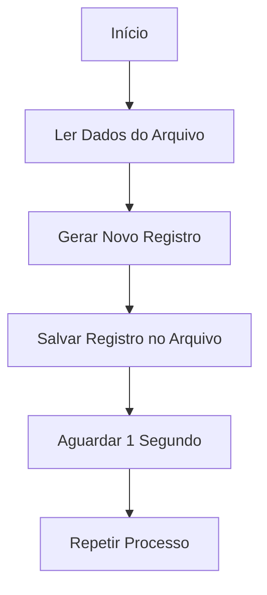
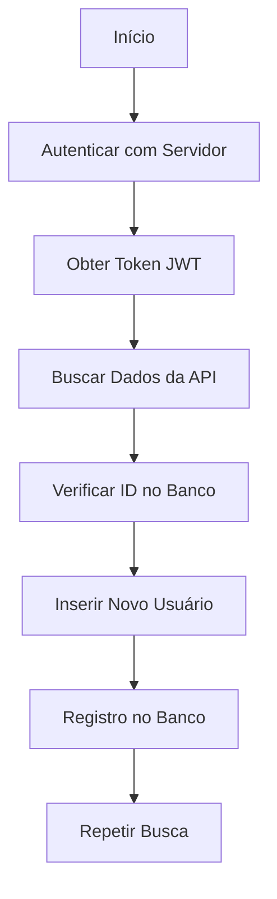

## 🚀 **Server-Client Flask API Real-Time**

### 🌟 **Visão Geral do Projeto**

Este projeto é uma **micro aplicação** prática que demonstra a integração entre um servidor e um cliente usando **Flask**, **JWT**, e **SQLite**. A aplicação é composta por três partes principais:

1. **Servidor Flask**: Lê dados em tempo real de um arquivo JSON e fornece esses dados via API.
2. **Cliente Flask**: Consome a API, coleta dados e os grava em um banco de dados SQLite.
3. **Gerador de Dados**: Gera e atualiza registros de vendas em um arquivo JSON.

## 📊 **Diagramas do Projeto**

### 1. **Diagrama do Servidor Flask** 🖥️

### 📂 **Componentes Principais**

- **Servidor Flask**: [🔗 `server.py`](https://github.com/evolucaoit/Server_Client_Flask-API_Resltime/blob/main/server.py)
  - O servidor expõe uma API RESTful que lê e serve dados de `data.json` para o cliente. Ele também gerencia a autenticação com JWT para garantir segurança nas comunicações. 🔐

- **Gerador de Dados**: [🔗 `gera-registro-json-data.py`](https://github.com/evolucaoit/Server_Client_Flask-API_Resltime/blob/main/gera-registro-json-data.py)
  - Este script gera registros de vendas e os salva em `data.json`, simulando uma fonte de dados em tempo real. 📈

- **Cliente Flask**: [🔗 `client.py`](https://github.com/evolucaoit/Server_Client_Flask-API_Resltime/blob/main/client.py)
  - O cliente consome a API do servidor, processa os dados e armazena informações no banco de dados SQLite. Ele também utiliza JWT para autenticar as requisições. 🗃️

### 🌐 **Como Funciona**

1. **Inicie o Servidor**: Execute o `server.py` para iniciar o servidor Flask que fornece a API.
2. **Execute o Gerador de Dados**: Rode `gera-registro-json-data.py` para criar e atualizar `data.json` com novos registros de vendas.
3. **Inicie o Cliente**: Execute o `client.py` para consumir os dados da API e gravá-los no banco de dados SQLite.

### 🔧 **Tecnologias Utilizadas**

- **Flask**: Framework web para criar APIs RESTful. 🧩
- **JWT (JSON Web Tokens)**: Para autenticação segura. 🔒
- **SQLite**: Banco de dados para armazenamento local. 💾

### 🎯 **O Que Este Projeto Demonstra**

- **Integração Server-Client**: Como construir e conectar um servidor e cliente usando Flask e JWT.
- **Gerenciamento de Dados em Tempo Real**: Processamento e armazenamento de dados dinâmicos.
- **Segurança com JWT**: Implementação de autenticação segura em APIs.

### 🌟 **Links Importantes**

- **Repositório do Projeto**: [Server_Client_Flask-API_Resltime](https://github.com/evolucaoit/Server_Client_Flask-API_Resltime)
- **Portfólio**: [Evolução IT](https://github.com/evolucaoit)
- **Outros Projetos**: [Chaos4455](https://github.com/chaos4455)
- **LinkedIn**: [Elias Andrade](https://br.linkedin.com/in/itilmgf)

---

🚀 Explore o projeto e descubra como construir uma solução prática e segura com Flask e JWT. Se tiver dúvidas ou quiser colaborar, entre em contato!

*Elias Andrade* 🌟
